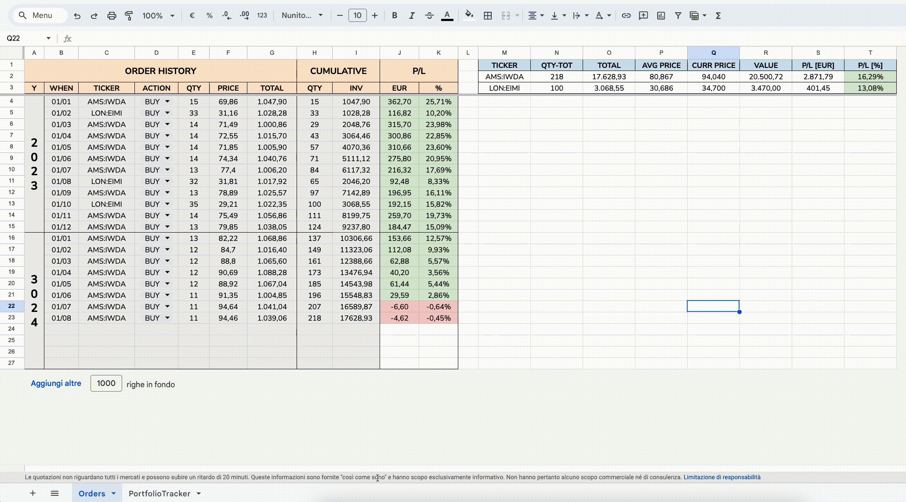

## Portfolio Tracker 

    

If you're a financial geek with a spreadsheet tracking your ETF or stock orders — or if you're planning to create one — I've developed a template and script that allows you to track your portfolio value over time with customizable dates.

While some brokers offer similar features, this historical data might be lost if you switch brokers. More importantly, how cool is it to create and customize something that perfectly fits your needs?

## Spreadsheet template

This setup is not entirely plug-and-play with every "order" sheet and may require some fine-tuning to suit your specific needs. To help you get started, I'm sharing a [`reference template`](https://docs.google.com/spreadsheets/d/12mqeMWg-1xK5-K2SRkQY261HFo5unDdcXxyPENgX1hU/edit?gid=599608793#gid=599608793).

> [!CAUTION]
> Make a copy and work on it locally! 

The template includes two main sheets:

#### Sheet - `Orders`
This primary sheet is where you track your orders. Here you can:
- Quantify gains (or losses..) for each individual order.
- Calculate total gains (or losses..) for each ETF/Stock.

> [!CAUTION]
> Do not add or remove columns in this sheet, as it may affect the functionality. However, feel free to add new beautiful plots or other customizations - your imagination is the only limit!

#### Sheet - `Performance`

This sheet is where the magic happens! It tracks your portfolio's performance over time. To make this work, you'll need a `custom Google Apps Script`. This is already embedded in the provided template, but you can also have a look at it [`here`](./PortfolioTracker.js).

The script runs when you press the button. To visualize & modify the script on spreadsheet, go to `AddOn > AppScript`.

> [!IMPORTANT]
> The first time you press the button, you'll be asked to grant permission via your Google account.

The first four lines of the Performance sheet contain our hyperparameters:

* `TICKERS`: A list of stock tickers, separated by semicolons.
* `START DATE`: The beginning of the date range for tracking.
* `END DATE`: The end of the date range for tracking.
* `INTERVAL`: The interval (in days) between each tracked date.

Once you press the button, the script executes the following steps:
1. `Define the Date Range`: According to the chosen hyperparameters.
2. `Fetch Stock Prices`: Using `GOOGLEFINANCE` APIs.
3. `Calculate Portfolio Value`: Determine the value of the portfolio on each date, considering the quantity of shares held at that time.
4. `Track Portfolio Value Over Time`: Finally, enjoy a simple yet satisfying plot of your portfolio's performance.

### Contributing
Contributions are welcome! I'm always looking to improve my personal spreadsheets. If you have ideas for enhancing this project or adding new features, please feel free to raise an issue, and let's discuss!

### License
This project is licensed under the MIT License. 